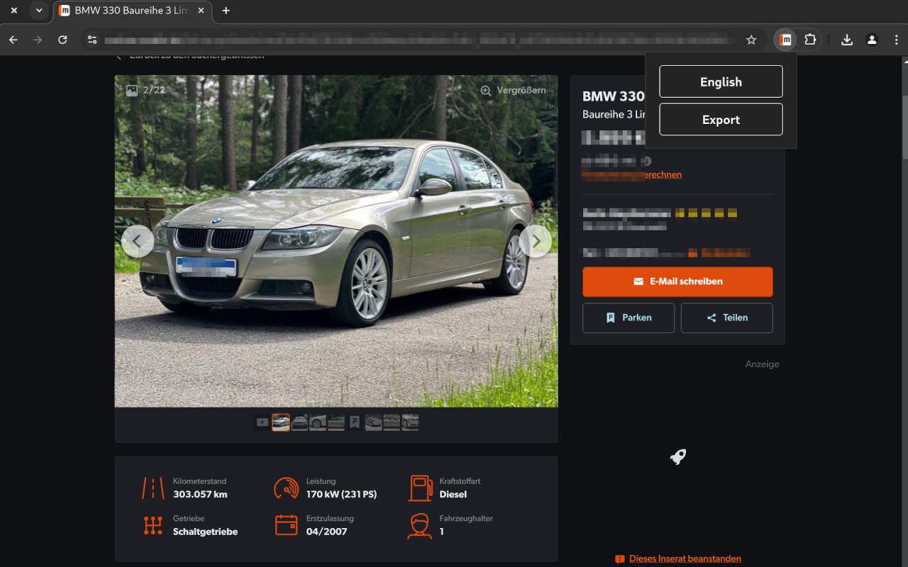
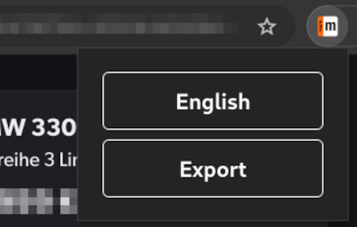

<a href="https://www.mobile.de">mobile.de</a> PDF export

## 📖 Description

- Export car ads with full details and pictures
- Archive ads as PDFs
- Translate attributes, features and descriptions to the language of your choice

## 🚀 Download

 [**Chrome**](https://chromewebstore.google.com/detail/mobilede-pdf-export/fnjfhjjofjobpefcbcajbbklljjhnnlm)
